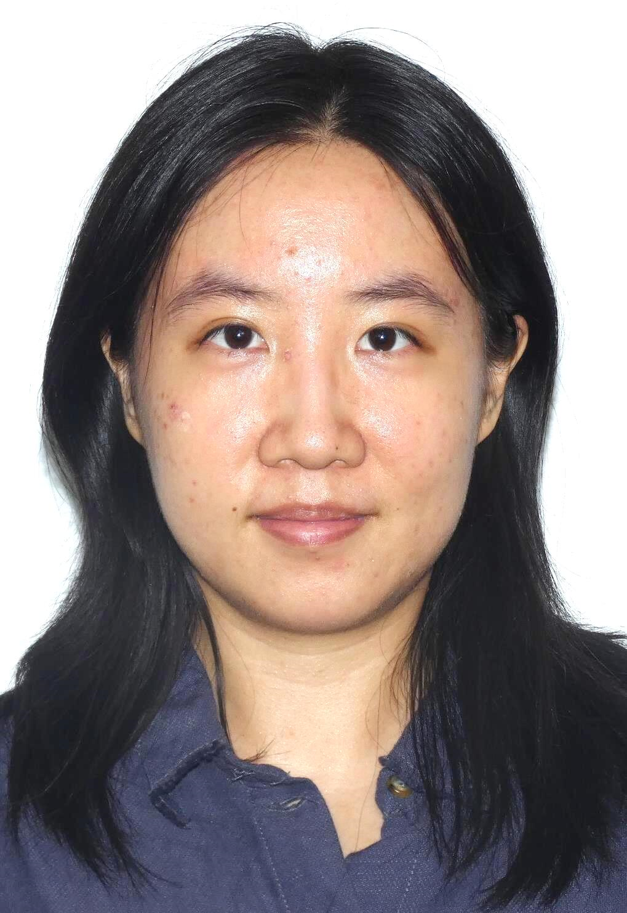

# Welcome!

I am a Ph.D. Candidate in Economics at the University of Washington.  
My research examines how household dynamics and family structure interact with tax policies that shape female labor supply across the life cycle.

    <!-- THIS stops text from wrapping the image -->

My research lies at the intersection of:

- Macroeconomics  
- Public finance  
- Applied Microeconomics  
- Labor
- Family Economics

I am currently on the 2025–2026 job market.  
You can find my **Job Market Paper**, teaching materials, and CV through the navigation bar above.

## Contact

**Email:** tianzyao@uw.edu  
**Phone:** 206-928-4760  

University of Washington  
Department of Economics  
Seattle, WA  

